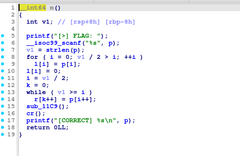
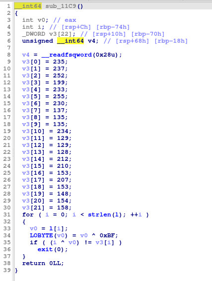
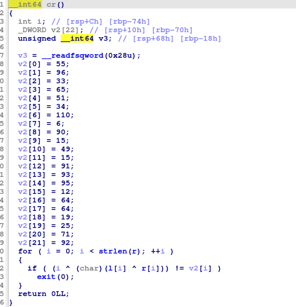

# 101 - Reversing

FLAG

```
TSA{RE_101_522eb6a4814c2b9eb70b7d1eb4af052b}
```

## Analysis

We got a file which is ELF 64-bit which when executed it request an input of name. After checking the protection that exist on the file using Checksec, it found that all of the protections are up. Then we decompile it using IDA and found two interesting function, which is `m` function,`sub_11c9` function and `cr` function. Here's a picture of the each function details:

<figure><figcaption><p>Main Function</p></figcaption></figure>

`m` function in here is used to get the input from the user and split it into two part. The first part stored in array l and the other half stored in array r.

<figure><figcaption><p>sub_11c9 Function</p></figcaption></figure>

Went to another function which `sub_11c9 function`. We got a function that doing a XOR operation for array l with 0xBF and then the yield of the XOR operation used in another XOR operation with i value which is the length of array l. And then check if it's equal to that value of array v3, if it's not then it end the program.

<figure><figcaption><p>cr Function</p></figcaption></figure>

Last but not least the `cr` function which also doing alike with `sub_11c9 function`. Where this function done a XOR operation within three variable within as follows i variable which is the length of array r then do XOR operation with the result of XOR operation of array in l with array in r. Then the outcome compare with the array in v2, if it's not equal then it would end the program.

So throughout the analyzation that has been done, the logics that has been applied to made the code are as follows:

1. We need to use the content of array v2 and v3
2. Need to done the reversing for v2 first because on the `cr` function it used two arrays  which is l and r. So we need to reverse it in order to search the content of array l first. Then used it to reverse the v3 array content. The order for reversing it as follows (i ^ v3\[i]) ^ 0xBF
3. Next after we got the l array, we used it to reverse and get the content of array r. The order for reversing it as follows (i ^ v2\[i]) ^ l\[i]
4. After got the content of array l and r we merging it and Voila we got the Flag.


## Solver Script

```python
v3 = [235, 237, 252, 199, 233, 255, 230, 137, 135, 135, 234, 129, 129, 128, 212, 210, 153, 207, 153, 148, 154, 158]
v2 = [55, 96, 33, 65, 51, 34, 110, 6, 90, 15, 49, 15, 91, 93, 95, 12, 64, 64, 19, 25, 71, 92]
length = len(v3)
l = []
r = []
for i in range(length):
   l_value = (i ^ v3[i]) ^ 0xBF
   l.append(l_value) 
for i in range(length):
   r_value = (i ^ v2[i]) ^ l[i] 
   r.append(r_value)
l_chars = ''.join(chr(value) for value in l)
r_chars = ''.join(chr(value) for value in r)
p = l_chars + r_chars
print("Generated input:", p)
```
