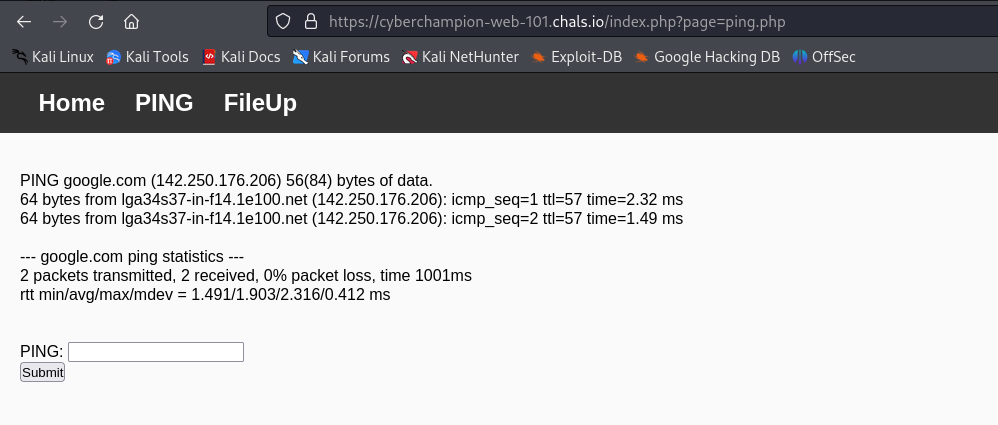
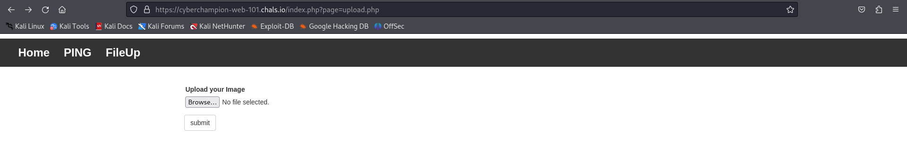
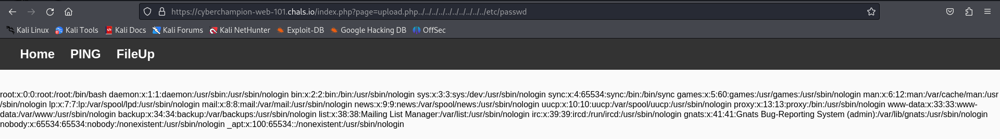
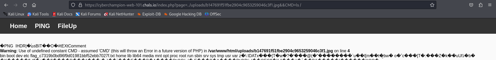
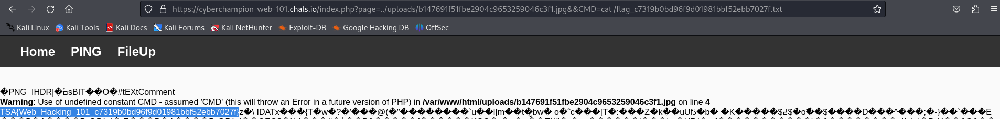

# 101 - Web Exploitation

FLAG

```
TSA{Web_Hacking_101_c7319b0bd96f9d01981bbf52ebb7027f}
```

## Analysis

Given a website that have 3 pages which are Home, Ping and Upload File. The thing that's immediately got into me are the Ping and Upload File page. Here's a picture for each of those two pages:

<figure><figcaption><p>Ping Page</p></figcaption></figure>

<figure><figcaption><p>Upload File Page</p></figcaption></figure>

<figure><figcaption><p>Testing LFI</p></figcaption></figure>

The thing that i immediately check is basic command injection for the ping and path traversal vulnerability. For the first one which is basic command injection, it didn't work even if i used the URL encode. And after i check the later one, it's actually working because of the website using a parameter include to the page so it's vulnerability to Local File Inclusion (LFI). Also this easier because the path is being provided for our uploaded file but the file that could be upload are restricted within some rules.

## Solution

Create a JPG file that contains our script using `exiftool`, the command are here:

```sh
exiftool --comment='<?php system($_GET[CMD]);?>' <file name> -o <output of file name>
```

After that upload the JPG file that contains our script, copy the path that are shown in the website and modify the URL corresponding with the given URL to done the Local File Inclusion. Also don't forget to use command injection to execute the command that we already instilled on the JPG file so that we could  get the information of the system. Here's the instance of that:

<figure><figcaption><p>Got some information from ls /</p></figcaption></figure>

And after some searching we found out the flag that we were looking for, just cat the flag and voila we got the flag.

<figure><figcaption><p>cat the flag</p></figcaption></figure>

